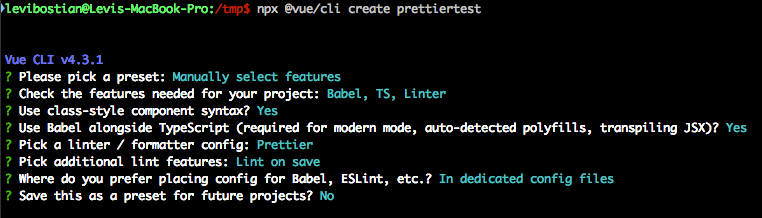

# Example project

This example vuejs application is meant to be a place that you can test out your changes to the sharable eslint config file. 

This example project was generated using the vuejs CLI tool:



Vuejs is changing all the time. This example project may need to be regenerated at some point. 

# Getting started

```
npm install
npm run lint
```

You will probably see errors and warnings printed to the console. That's ok! We want that to happen because it shows that the eslint config is working. 